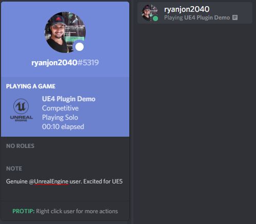
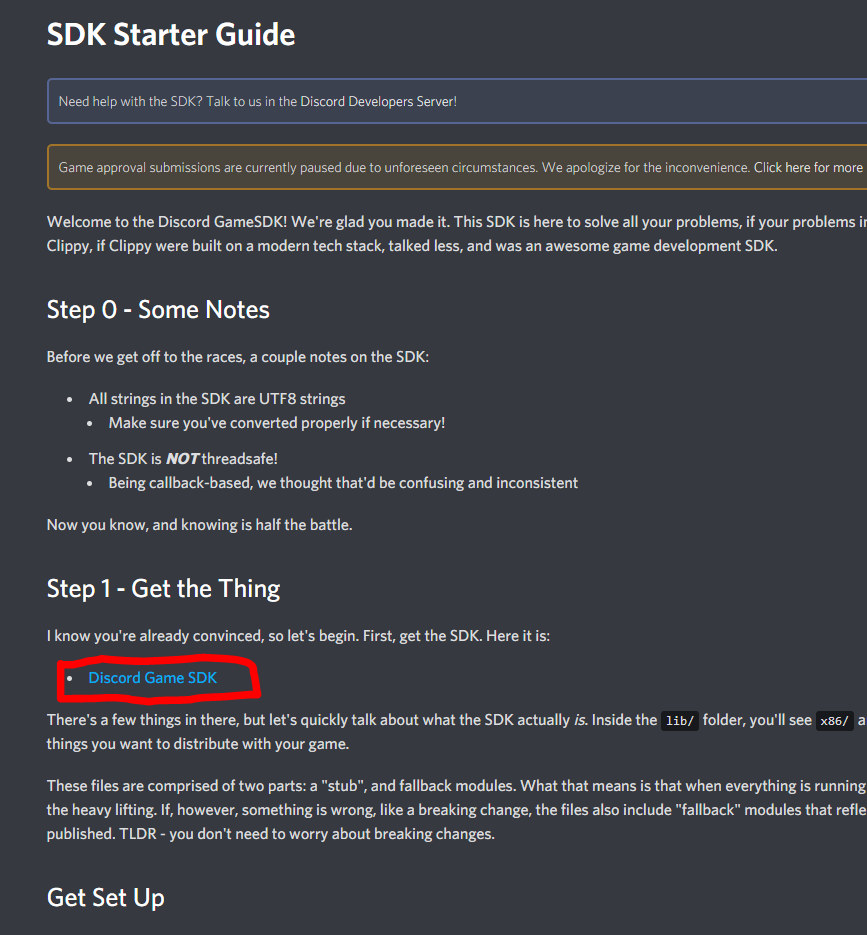
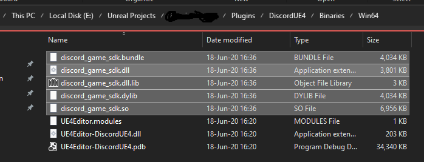
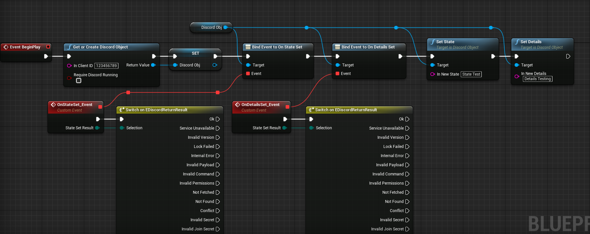

# Discord-UE4

Plugin for integrating Discord Rich Presence in Unreal Engine 4. Blueprints only example project is [available here](https://github.com/ryanjon2040/Discord-UE4-Example-Project).

   

# How to
First you will need to download the binaries from Discord. Head over to [Discord Developer Portal](https://discord.com/developers/docs/game-sdk/sdk-starter-guide) and download **Discord Game SDK**.

After downloading, open the zip file and extract the `.dll` and `.lib` files from the `lib/x86_64` folder to `Binaries/Win64/` folder of this plugin. If you don't have `Binaries/Win64` folder, create it. Example of my setup:

After copying the binary files, open the `cpp` folder inside the zip file and extract all the contents to `Source/DiscordUE4/discord-files` folder. If the `discord-files` folder doesn't exist, create it.

Now you are good to go.

It is important to setup your game according to [Discord Startup Guide](https://discord.com/developers/docs/game-sdk/sdk-starter-guide). 

Example Setup:

